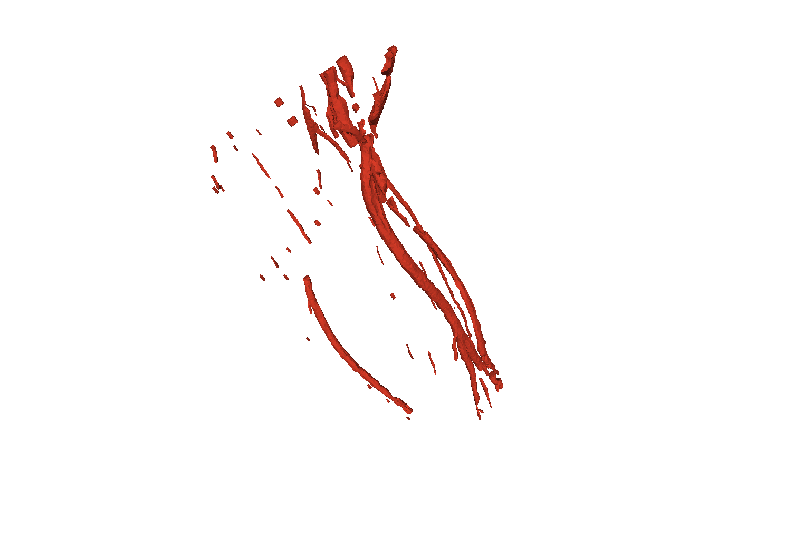

# AS_DICOM2STL

The software can be used to prepare a 3D model of a limb. The input data for the process is the data from a MRI (Magnetic Resonance Imaging) study of a user's limb.
The software uses neural networks to perform the segmentation of the tissues within the axial scans of the limb and creates a 3D model of selected tissues in a form of a STL file, separate for each tissue. The processing chain is fully automatic, the input data are the files from the MRI study, and the output data are the STL files.

## Requirements

The software has been tested to work with Python 3.12.7. 

The software requires the following libraries, and was tested to work with the following versions thereof. 

## Usage

### Step 1

In order to process data for a new user, first place the content of a disk with study data in the *as_input_dicom/user_dicom_folder* folder where a *user_dicom_folder* should be of a form \<L\>\<ID\>_\<NAME\>, e.g. *X000001_John_Doe* 

\<L\> is a single letter label to denote the type of the data. Please use **X** here.

\<ID\> is a **6 digit** identification number.

\<NAME\> can be used to store the name of a user, any **alphanumeric string** without spaces could be used.

In all the stages of the AS_DICOM2STL pipeline the \<L\>\<ID\> (in the example it will be *X000001*) will be used to identify the user.  

Importing the DICOM files from the study files 
- for all the directories in the *as_input_dicom*:
	```sh
	python import_dicom.py
	```
- for a single user, form a folder *as_input_dicom/X000001_John_Doe*:
	```sh
	python import_dicom.py -usrID X000001_John_Doe
	```
### Step 2
Process all stages from 0 to 24: 
- for all users and all sessions for any user:
	```sh
	python process_all.py
	```
- for a single user and all sessions:
	```sh
	python process_all.py -ses X000001/*
	```
- for a single user and a selected session:
	```sh
	python process_all.py -ses X000001/00008
	```
Script process_all.py can also start a range of stages. More info about that and a description of stages can be displayed using this command:
```sh
python ./process_all.py -h
```
Script process_all.py starts consecutive process_st##.py scripts.

Each stage can be started also by direct start of a process_st##.py script without using process_all.py, e.g.:
```sh
python ./process_st00.py -ses */*
```

### Step 3

Wait for the consecutive processing stages to complete.

### Step 4

Collect the 3D model from the directory *as_data/st24_remeshed/volume/\<L\>\<ID\>/\<SES_ID\>* e.g. *as_data/st24_remeshed/volume/X000000/000008*. If more tan one session has parameters satisfying the requirements, separate 3D models will be available in different directories, e.g. *as_data/st24_remeshed/volume/X003476/000002* and *as_data/st24_remeshed/volume/X003476/000005*.

## Example

In this example, the data from a study of an upper limb was used to prepare a 3D model of the upper limb.

One of the images extracted from the study, after non-linear correction:


The same image after cropping to ROI (ROI is calculated for the whole limb, hence the margin to the right):


The tissues labelled with the use of the network:


The same tissues after corrections:


The resulting STL files for skin, bones and vessels, after the remeshing step. This is the final output of the processing chain:





## Advanced options

Although the software is prepared as to prcess the input data in a fully automatic way, it may happen that, mostly due to the improperly performed study, the data will not be entirely consistient with the requirements. In such a case, there is a possibility to override the default settings of some processing stages. 

The directory *as_cfg* contains files with additional options for the processing in different stages. Not all stages support additional configuration. The configuration is provided for a certain session and a certain user, and the user and session is specified in the name of the file. To modify the processing parameters for user X000000 and session 000008, the file must be named *X000000_000008.cfg*. The parameters are provided in json format. The example contents of such a configuration file is shown below:

```json
{
	"st00":{
		"cropcenterx": 226,
		"cropcentery": 343,
		"cropradius": 150
	},
	"st01":{
		"fo": "all"
	}
}
```

The parameters are provided for each stage. In this example in the stage st00 the images are supposed to be preprocessed in such a way as to remove all objects (effectively by setting the pixels to zero) outside the circle with a specified centre and a specified radius. This is useful when some other parts of the body are present in the scan. A common case is the presence of a patient's head for upper limb scans. 
For stage st01 it is specified to allow the scans with any orientation setting of the scan.
For other possible settings please refer to the sample configuration files provided in *as_cfg* and to the source code in files *process_st##.py*.
